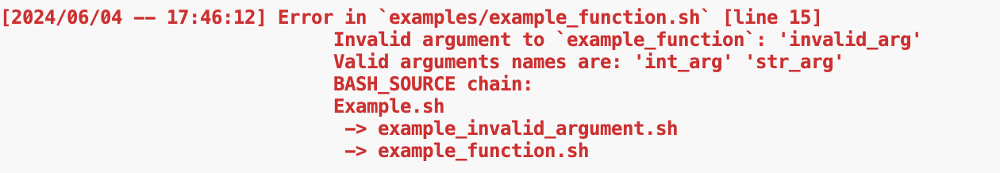

Simple functions for creating and formating documentation of bash scripts / functions

### Create documentation

#### `init_doc`

Initialize the documentation block

##### Arguments
none

#### `init_desc`

Set the description of the function / script

##### Arguments

- `$1,...,$n`: Lines of the description

#### `init_arg`

Initialize named arguments to be set via `--arg=val` or `--arg val` (using one or two dashes)

##### Arguments

- **`$1`**: Argument type  
- **`$2`**: Argument name
- **`$3`**: Argument description
- **`$4`**: Default value

### Set arguments

#### `parse_arguments`
Set arguments passed as `--arg=val` or `--arg val` (using one or two dashes).
Should be used as `eval "$(parse_arguments "$@")"`

##### Arguments

- **`$1,...,$n`**: Arguments to be set.

    
### Print help

#### `need_help`

Show the help if argument `-h` or `-help` (using one or two dashes) is present. If output is console and tput is available, tput is used for colouring (see examples).

##### Arguments

none

## Examples

The following basic examples how to use `bash-doc` are located in the `examples/` folder:

### Function definition

<pre class="r-output"><code>#!/usr/bin/env bash</code>
<code>source $(dirname "${BASH_SOURCE[0]}")/../bash-doc-init</code>
<code></code>
<code>function example_function {</code>
<code>    init_doc</code>
<code>    init_desc \</code>
<code>        "This is an" \</code>
<code>        "Example function"</code>
<code>    init_arg "int" "int_arg" "This is some int argument" "default_int"</code>
<code>    init_arg "str" "str_arg" "This is some string argument" "default_str"</code>
<code></code>
<code>    need_help $@ &amp;&amp; return $?</code>
<code></code>
<code>    eval "$(parse_arguments "$@")"</code>
<code></code>
<code>    echo "int_arg: ${int_arg[@]}"</code>
<code>    echo "str_arg: ${str_arg[@]}"</code>
<code></code>
<code>}</code></pre>

### Printing help

<pre class="r-output"><code>example_function --help</code></pre>

plot of chunk example_help_r

### Specifying arguments

Defaults are used if an argument is not specified:

<pre class="r-output"><code>example_function --str_arg "Example 1"</code></pre>

<pre class="r-output"><code>int_arg: default_int</code>
<code>str_arg: Example 1</code></pre>

<pre class="r-output"><code>example_function --int_arg "2"</code></pre>

<pre class="r-output"><code>int_arg: 2</code>
<code>str_arg: default_str</code></pre>

but setting an argument overwrites the defaults:

<pre class="r-output"><code>example_function --int_arg "3" --str_arg "Example 3"</code></pre>

<pre class="r-output"><code>int_arg: 3</code>
<code>str_arg: Example 3</code></pre>

In any case, it is checked that only valid arguments are passed. An error is thrown otherwise:

<pre class="r-output"><code>example_function --int_arg "4" --invalid_arg "Example 4"</code></pre>

plot of chunk example_invalid_argument_r

