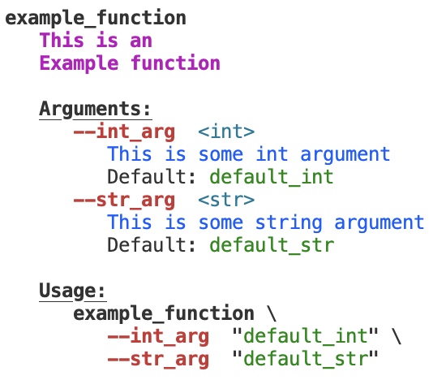

# bash-doc


Simple functions for creating and formating documentation of bash scripts / functions.

### Create documentation

#### `init_doc`

Initialize the documentation block

##### Arguments
none

#### `init_desc`

Set the description of the function / script

##### Arguments

- `$1,...,$n`: Lines of the description

#### `init_arg`

Initialize named arguments to be set via `--arg=val` or `--arg val` (using one or two dashes)

##### Arguments

- **`$1`**: Argument type  
- **`$2`**: Argument name
- **`$3`**: Argument description
- **`$4`**: Default value

### Set arguments

#### `parse_arguments`
Set arguments passed as `--arg=val` or `--arg val` (using one or two dashes).
Should be used as `eval "$(parse_arguments "$@")"`

##### Arguments

- **`$1,...,$n`**: Arguments to be set.

    
### Print help

#### `need_help`

Show the help if argument `-h` or `-help` (using one or two dashes) is present. If output is console and tput is available, tput is used for colouring (see examples).

##### Arguments

none

## Examples


The following basic examples how to use `bash-doc` are located in the `[examples/](examples/)` folder:

### Function definition

```bash
#!/usr/bin/env bash

source $(dirname "${BASH_SOURCE[0]}")/../bash-doc-init

function example_function {
    init_doc
    init_desc \
        "This is an" \
        "Example function"
    init_arg "int" "int_arg" "This is some int argument" "default_int"
    init_arg "str" "str_arg" "This is some string argument" "default_str"

    need_help $@ && return $?

    eval "$(parse_arguments "$@")"

    echo "int_arg: ${int_arg[@]}"
    echo "str_arg: ${str_arg[@]}"

}

```

### Printing help

```bash
example_function --help

```




### Specifying arguments

Defaults are used if an argument is not specified:

```bash
example_function --str_arg "Example 1"

```

```bash
int_arg: default_int
str_arg: Example 1

```

```bash
example_function --int_arg "2"

```

```bash
int_arg: 2
str_arg: default_str

```

but setting an argument overwrites the defaults:

```bash
example_function --int_arg "3" --str_arg "Example 3"

```

```bash
int_arg: 3
str_arg: Example 3

```

In any case, it is checked that only valid arguments are passed. An error is thrown otherwise:

```bash
example_function --int_arg "4" --invalid_arg "Example 4"

```


